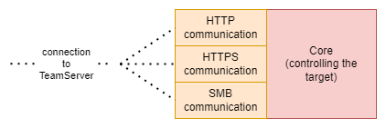

The beacon will be structured in two parts:
- communicator
- core

The diagram looks like this:

# Core
*The core* will contain the actual code of the beacon behaviour. It will provide support to execute commands:
- in the same process of the beacon
- fork & run - create a new process in the same token context and execute the command
- mimikatz integration
- general lateral privilege escalation integrations (PsExen, WinRM and other)