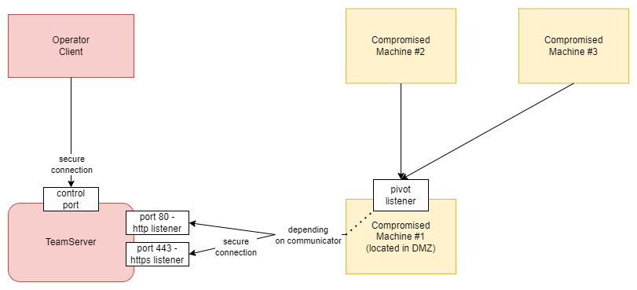

Here we can describe the architecture in a whole and how we can secure the communication between entities.
# The Big Picture

## TeamServer
The *teamserver* will expose a specific port that will be used by client program in order to control the captured beacons or to generate payloads. This communication must be secured with SSL. and upon connection attempt (from *client* to *teamserver*), a prompt will appear on the client machine, asking the operator to confirm the certificate thumbprint.

**IMPORTANT:** In order to validate the certificates used to encrypt the communication, I would recommend to use thumbprint validation using the SHA256 thumbprint. This will mitigate the risk for Shattered vulnerability (see [this link](https://shattered.io/)).

Other ports will be exposed upon listener creation. One listener will require one port opened on the teamserver. In the beginning, I would propose to create the following beacon communicators:
- http listener
- https listener
- smb listener

Ports used for each listener will be chosen by the operator in listener creation process.

Regarding communication teamserver-client, for simplicity, I would propose to expose an API from teamserver, used by client to make several requests from his machine, requests that will trigger some actions on teamserver.
## Client Program
This project will offer the operator a nice UI to control the beacons from the teamserver.
## Beacon
The beacon is a service that runs silently on the compromised machine, in order to offer the operator full access to the system. The beacon will have a sleep time set by the operator. After sleep time period, the beacon will make a request to the teamserver (using a specific protocol) and will get the commands issued by the operator (we will discuss how the commands will be stored in the **communicator section**).